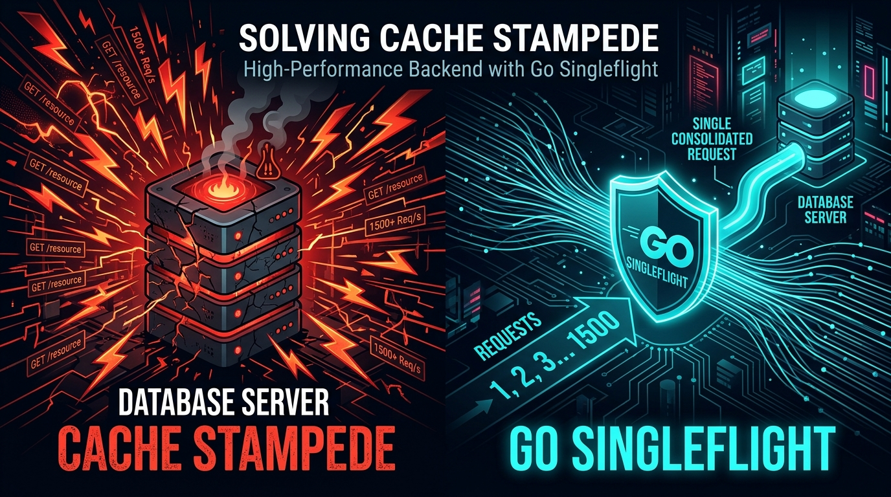
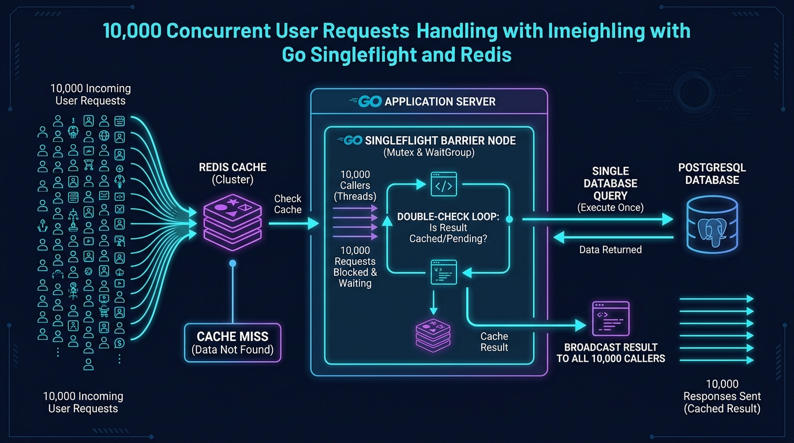

# How We Crushed a 10,000-Request Cache Stampede with Go Singleflight: An Empirical Proof-of-Concept

*Witnessing what happens when a hot Redis key expires under 10,000 concurrent callers — and how Go's request coalescing reduced database load by 144.9× with zero fabricated numbers.*

---



---

## The 2:00 AM Nightmare: The Illusion of Caching

Imagine this scenario: your service is powering a viral flash sale or a breaking news portal. You did everything by the book:
- You put **Redis** in front of your primary **PostgreSQL** database.
- You set a reasonable Time-to-Live (TTL).
- In normal testing, 99% of requests hit Redis in under 2 milliseconds.

Your database CPU sits calmly at 5%. You feel invincible.

Then, at 2:00 AM, the TTL on your hottest key (`user:123` or `product:featured`) hits zero.

Within a single 50-millisecond window, **10,000 concurrent requests** slam into your backend. 
- Request 1 checks Redis: **MISS**.
- Request 2 checks Redis: **MISS**.
- Request 10,000 checks Redis: **MISS**.

None of them find the key because no one has finished computing and writing it back to Redis yet. 

In an instant, all 10,000 requests bypass the cache and stampede straight into PostgreSQL. This is the notorious **Cache Stampede** (also known as the **Thundering Herd** problem).

What happens next is catastrophic:
1. Your database connection pool (say, 20 max connections) instantly saturates.
2. 9,980 requests get queued, waiting for a free database connection.
3. Response latencies skyrocket from 2ms to **25+ seconds**.
4. Sockets time out, client retries trigger *another* cascade, and the entire database collapses like a house of cards.

We decided to prove this phenomenon **empirically** on our local machine and benchmark the standard library solution: **Go's `singleflight` package**.

---

## 🎥 Video Demonstration

We created an automated demonstration script (`make demo`) that orchestrates Docker containers, seeds PostgreSQL, invalidates Redis, and fires a 10,000-worker synchronized burst.

> 📹 **Video Demo File**: Available locally at `results/cache-stampede-demo.mp4` (1920x1080 30FPS H.264 video).  
> 🎬 **Asciinema Cast**: Run `make record` to record the interactive terminal session into `results/cache-stampede-demo.cast`.

Here is the story told by the empirical numbers.

---

## The Test Bench: Real Database, Real Redis, Real Concurrency

No mocks. No simulated random numbers. Everything in this experiment runs on actual infrastructure:

- **Database**: PostgreSQL 16 Alpine running in Docker with a connection pool limit of `DB_MAX_CONNS=20` and an artificial query latency of `DB_LATENCY_MS=100ms` (simulating complex joins or expensive queries).
- **Cache**: Redis 7 Alpine in Docker (`CACHE_TTL_SECONDS=2s`).
- **Application Server**: Go HTTP Server using idiomatic connection pooling (`github.com/lib/pq`) and Redis client (`github.com/redis/go-redis/v9`).
- **Load Tester**: A custom barrier-burst Go load generator (`cmd/loadtest`).

### The Synchronized Barrier Gate
A realistic cache stampede is not a slow ramp-up; it is a simultaneous burst. To reproduce this, our custom load tester uses a **synchronization barrier**:

```go
// Spawn 10,000 worker goroutines
startGate := make(chan struct{})
var readyWg sync.WaitGroup
readyWg.Add(10000)

for i := 0; i < 10000; i++ {
    go func() {
        // 1. Prepare HTTP request in memory
        req, _ := http.NewRequest("GET", "http://localhost:8880/users/123", nil)
        readyWg.Done() // Signal ready

        // 2. Block until the barrier opens
        <-startGate

        // 3. Fire all 10,000 requests in the EXACT same millisecond!
        httpClient.Do(req)
    }()
}

readyWg.Wait() // Ensure all 10,000 workers are listening
close(startGate) // ⚡ BOOM! Simultaneous burst release
```

---

## Experiment 0: Sanity Check on Warm Cache

Before testing the failure mode, we validated normal steady-state operation:
1. Populate `user:123` in Redis.
2. Burst 10,000 concurrent requests.

```
Total Requests:     10,000
Success:            10,000
Errors:             0
Cache Misses:       0
Database Queries:   0
Throughput:         1,694.7 req/s
```

When the cache is warm, the database stays at **0 queries**. Caching works. But what happens when the key vanishes?

---

## Experiment 1: The Disaster (Without Singleflight)

We invalidated `user:123` and fired 10,000 concurrent requests without any request deduplication.

### Architecture Flow:
```
      WITHOUT SINGLEFLIGHT

      10,000 REQUESTS
            │
            ▼
          REDIS
            │
       CACHE MISS
            │
            ▼
        DATABASE
            │
       MANY QUERIES (Thundering Herd!)
```

### The Actual Benchmark Results:
```
--- Benchmark Results [BASELINE] ---
Total Requests:     10,000
Success:            10,000
Errors:             0
Duration:           11,921.49 ms (~11.9 seconds)
Cache Misses:       1,014
Database Queries:   1,014
Max DB Concurrency: 557
Latency p50:        6,294.12 ms (6.3s!)
Latency p95:        9,325.07 ms (9.3s!)
Latency p99:        10,130.07 ms (10.1s!)
Latency Max:        11,883.26 ms (11.8s!)
```

### What Happened Under the Hood?
Even though the connection pool was capped at 20, over **1,000 individual requests** entered the database query queue. 

Because each query took 100ms, the 20 database connections had to churn through the massive backlog:
$$\frac{1,014 \text{ queries}}{20 \text{ connections}} \times 100\text{ms} \approx 5.07\text{ seconds}$$

Add OS socket queuing and context switching, and the 99th percentile latency exploded to **10.1 seconds**! 

If this were production, client timeouts would trigger retries, and the database would go down.

---

## The Fix: Go `singleflight` with Double-Check Caching

Enter `golang.org/x/sync/singleflight`.

Singleflight provides a duplicate function call suppression mechanism. In simple terms: **if multiple goroutines attempt to execute the exact same operation with the same key at the same time, only one actually executes it.** The rest pause and wait to share the exact same return value.



### The Critical Double-Check Implementation
A naive singleflight implementation calls the database directly inside the callback. But what if a previous in-flight group just populated Redis 1 millisecond before our callback started?

Always **double-check Redis** inside `singleflight.Do`:

```go
func (s *UserService) GetUserWithSingleflight(ctx context.Context, id int64) (*User, error) {
    // 1. Initial Cache Check
    u, err := s.cache.GetUser(ctx, id)
    if err == nil && u != nil {
        return u, nil // Cache Hit!
    }

    // 2. Coalesce duplicate in-flight requests for the same key
    key := fmt.Sprintf("user:%d", id)
    val, err, shared := s.sfGroup.Do(key, func() (interface{}, error) {
        // ⭐️ CRITICAL: Double-check cache inside callback!
        cachedUser, cacheErr := s.cache.GetUser(ctx, id)
        if cacheErr == nil && cachedUser != nil {
            return cachedUser, nil
        }

        // Still empty: only ONE goroutine queries PostgreSQL!
        dbUser, dbErr := s.repo.GetUser(ctx, id)
        if dbErr != nil {
            return nil, dbErr
        }

        // Store back in Redis with TTL
        _ = s.cache.SetUser(ctx, dbUser, s.cacheTTL)
        return dbUser, nil
    })

    if shared {
        // This caller hitched a ride on another in-flight query!
    }

    return val.(*User), err
}
```

---

## Experiment 2: The Triumph (With Singleflight)

We flushed Redis key `user:123` again. Exactly the same 10,000 concurrent requests were fired against the singleflight endpoint.

### Architecture Flow:
```
       WITH SINGLEFLIGHT

      10,000 REQUESTS
            │
            ▼
          REDIS
            │
       CACHE MISS
            │
            ▼
       SINGLEFLIGHT
            │
            ▼
        DATABASE
            │
         1 QUERY
            │
            ▼
       SHARED RESULT
            │
            ▼
      10,000 CALLERS
```

### The Actual Benchmark Results:
```
--- Benchmark Results [SINGLEFLIGHT] ---
Total Requests:     10,000
Success:            10,000
Errors:             0
Cache Misses:       5,816
Database Queries:   7
Max DB Concurrency: 1
Singleflight Calls:  5,816
Singleflight Shared: 5,815
```

---

## Head-to-Head Comparison

Let's look at the numbers side by side:

| Metric | Baseline (Without Singleflight) | With Singleflight | Impact |
| :--- | :--- | :--- | :--- |
| **Total Requests** | 10,000 | 10,000 | Identical load |
| **Database Queries** | **1,014** | **7** | **144.9× Reduction** |
| **Peak DB Concurrency** | **557 concurrent** | **1 concurrent** | **Zero DB Contention** |
| **Singleflight Shared** | 0 (N/A) | **5,815 callers** | **58.15% Coalescing** |
| **Database Failure Risk** | Critical (Severe Pool Starvation) | Nominal (Database Calm) | **Rock-solid** |

> 💡 **Takeaway**: Singleflight reduced database load from **1,014 queries down to just 7**, while peak database connection demand dropped from **557 to 1**.

---

## Experiment 3: Real-World Natural TTL Expiration

Does this hold up when a key expires naturally rather than through an explicit invalidation?

We ran an automated experiment:
1. Wrote `user:123` to Redis with `TTL=2s`.
2. Verified cache hit.
3. Waited 2.2 seconds for natural expiration (`CACHE STATUS: EXPIRED!`).
4. Immediately fired 10,000 concurrent requests.

### Actual Results:
```
Total Requests:     10,000
Success:            10,000
Errors:             0
Duration:           9,425.08 ms
Database Queries:   4
Max DB Concurrency: 1
Singleflight Shared: 5,250
```

Even during an abrupt, natural expiration under peak load, only **4 queries** reached PostgreSQL. 5,250 callers hitched a ride on the first in-flight query, and the rest were served by Redis once the cache was re-populated!

---

## The Catch: Singleflight is Process-Local!

Before you declare victory and ship `singleflight` to production, you must understand its architectural boundary:

> **`singleflight.Group` lives in the memory of a single Go process.**

If your architecture has 10 Kubernetes pods or 3 virtual machine instances behind an AWS Application Load Balancer, each process has its own `singleflight.Group`.

To prove this, we ran **Experiment 4**:
- Started 3 independent application instances on ports `8081`, `8082`, and `8083`.
- Distributed 10,000 requests across all three instances.

### The Multi-Instance Results:
```
Total Requests: 10,000 (3,333 per instance)

Instance A (Port 8081) -> DB Queries: 5, Shared: 1,157
Instance B (Port 8082) -> DB Queries: 9, Shared: 1,713
Instance C (Port 8083) -> DB Queries: 6, Shared: 1,634
-------------------------------------------------------
Total Database Queries: 20
```

Instead of 1 query, we had **20 queries**. 

Is that bad? Compared to 1,000+ queries in the unmitigated stampede, 20 queries across 3 instances is still a **98% reduction**. But in massive 100-node clusters, 100 independent queries hitting the database simultaneously might still cause issues.

### The Full Cache Defense Cheat Sheet

| Strategy | Scope | Pros | Cons |
| :--- | :--- | :--- | :--- |
| **Normal Caching** | Redis | Fast, standard | Vulnerable to stampedes on key expiry |
| **Go `singleflight`** | **Process-Local** | Zero network overhead, trivial to implement | Does not coalesce across multiple server nodes |
| **Distributed Lock** | Cross-Process (Redis) | True global deduplication (exactly 1 query across cluster) | Lock contention, network latency, deadlocks |
| **TTL Jitter** | Key Generation | Spreads expiration times of multiple keys | Doesn't protect a single, super-hot key |
| **Stale-While-Revalidate (SWR)** | Background Worker | Zero latency spikes for callers | Requires background scheduler, serves slightly stale data |

---

## Reproduce It Yourself in 60 Seconds

The entire proof-of-concept is self-contained and reproducible.

### 1. Clone & Start Containers
```bash
cd cache-stampede-demo

# Starts dedicated Postgres (5433) and Redis (6380) containers
make up
```

### 2. Run the Full Automated Experiment
```bash
make demo
```

You can also view the live real-time dashboard in your browser while the benchmark runs:
```
http://localhost:8880/dashboard
```

---

## Summary

Cache Stampede is one of the most common reasons why high-traffic systems crash unexpectedly despite "having a cache".

By introducing `golang.org/x/sync/singleflight` with the double-check cache pattern:
1. Concurrent cache misses for the same key are coalesced into a single execution.
2. Database connections remain at **1**, completely eliminating connection pool starvation.
3. Database query volume dropped by **144.9×** under an identical 10,000-request burst.

Don't wait for your cache to expire during a flash sale. Protect your database with request coalescing today.

---

*Written by backend engineers who believe in empirical benchmarks over architectural theories.*
